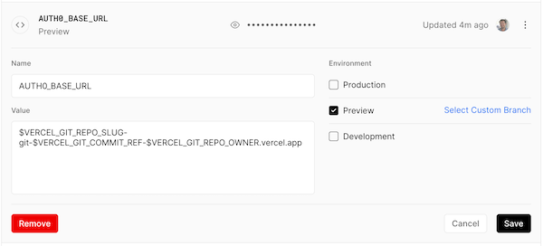
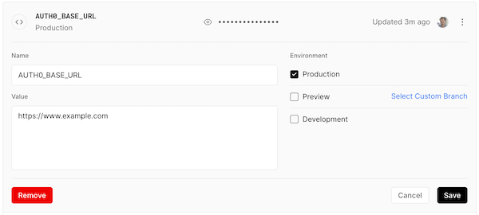

# Next.js Auth0 Examples

In this folder we'll be showing off different examples on how to use the [@auth0/nextjs-auth0](https://www.npmjs.com/package/@auth0/nextjs-auth0) package in your Next.js applications.

## Configuration

### Local Development

#### Configuring Auth0

Go to the [Auth0 dashboard](https://manage.auth0.com/) and create a new application of type **Web Application** and make sure to configure the following:

| Setting               | Description                                                                                                                                                            |
| --------------------- | ---------------------------------------------------------------------------------------------------------------------------------------------------------------------- |
| Allowed Callback URLs | Should be set to `http://localhost:3000/api/auth/callback` when testing locally or typically to `https://myapp.com/api/auth/callback` when deploying your application. |
| Allowed Logout URLs   | Should be set to `http://localhost:3000/` when testing locally or typically to `https://myapp.com/` when deploying your application.                                   |

#### Environment Variables

For local development you'll just want to create a `.env.local` file with the necessary settings:

```
AUTH0_SECRET=viloxyf_z2GW6K4CT-KQD_MoLEA2wqv5jWuq4Jd0P7ymgG5GJGMpvMneXZzhK3sL (at least 32 characters, used to encrypt the cookie)
AUTH0_ISSUER_BASE_URL=https://YOUR_AUTH0_DOMAIN
AUTH0_BASE_URL=http://localhost:3000/
AUTH0_CLIENT_ID=YOUR_AUTH0_CLIENT_ID
AUTH0_CLIENT_SECRET=YOUR_AUTH0_CLIENT_SECRET
AUTH0_SCOPE=openid profile read:shows
AUTH0_AUDIENCE=YOUR_AUTH0_API_IDENTIFIER
```

### Hosting on Vercel

The kitchen-sink example application is hosted on Vercel, including preview deployments to make Pull Request reviewing a bit easier in terms of verifying the functionalities in the example application.

#### Configuring Auth0

As every environment in Vercel, including preview deployments, has its unique URL, your Auth0 application needs to be configured to allow the corresponding Callback and Logout URLs.
This can be done manually, by going to the Application Settings on your [Auth0 dashboard](https://manage.auth0.com/) and make sure to configure the following:

| Setting               | Description                                                                                                |
| --------------------- | ---------------------------------------------------------------------------------------------------------- |
| Allowed Callback URLs | Should be set to `https://{YOUR_VERCEL_URL_PREFIX}.vercel.app/api/auth/callback` when deploying to vercel. |
| Allowed Logout URLs   | Should be set to `https://{YOUR_VERCEL_URL_PREFIX}.vercel.app/` when deploying to vercel.                  |

##### Wildcards

By default, Vercel uses the `vercel.app` domain for all of your environments. Using wildcards for a shared domain opens the possibility to redirect back to a malicious website, as long as the Callback URLs matches the wildcard configuration. Because of that, you should only consider using wildcards for the preview deployments when using a [Preview Deployment Suffix](https://vercel.com/docs/concepts/deployments/automatic-urls#preview-deployment-suffix), which is available as part of Vercel's Pro or Enterprise plan.

| Setting               | Description                                                                                                                  |
| --------------------- | ---------------------------------------------------------------------------------------------------------------------------- |
| Allowed Callback URLs | Should be set to `https://{VERCEL_GIT_REPO_SLUG}-*-{VERCEL_TEAM}.yourdomain.com/api/auth/callback` when deploying to vercel. |
| Allowed Logout URLs   | Should be set to `https://{VERCEL_GIT_REPO_SLUG}-*-{VERCEL_TEAM}.yourdomain.com/` when deploying to vercel.                  |

#### Configuring Vercel

If you do not have a vercel account yet, move over to https://vercel.com/ to sign up for one.
Once logged in to your account, you can create a new project and import a Git repository.

Vercel should automatically select the `Next.js` Framework Preset.
Because our deployment is a bit different from a standard Next.js repository, we will need to override the `Build and Output settings`:

- Build Command: `npm run build:vercel`
- Output Directory: `examples/kitchen-sink-example/.next`

The reason why we need to overrride these settings is because the Next.js app we want to build does not sit in the root of the repository. The example application is also dependent on the Next.js SDK, so we will need to ensure that Vercel executes the following commands when running `npm run build:vercel`:

- Build the SDK: `npm run build`
- Install the dependencies for the sample application: `npm i --prefix=examples/kitchen-sink-example`
- Build the sample application: `npm run build --prefix=examples/kitchen-sink-example`

As Vercel wants one single build command, we make use of the `build:vercel` npm script to run all of the above:

```
"build:vercel": "npm run install:examples && npm run build && npm run build:examples",
```

**Note**: Vercel runs `npm install` in the root of the repository by default, so we do not need to worry about that.

#### Environment Variables

Configure the following environment variables when importing your project or in "Settings > Environment Variables":

| Name                  | Value                                                                                                                 |
| --------------------- | --------------------------------------------------------------------------------------------------------------------- |
| AUTH0_SECRET          | viloxyf_z2GW6K4CT-KQD_MoLEA2wqv5jWuq4Jd0P7ymgG5GJGMpvMneXZzhK3sL (at least 32 characters, used to encrypt the cookie) |
| AUTH0_ISSUER_BASE_URL | https://YOUR_AUTH0_DOMAIN                                                                                             |
| AUTH0_CLIENT_ID       | YOUR_AUTH0_CLIENT_ID                                                                                                  |
| AUTH0_CLIENT_SECRET   | YOUR_AUTH0_CLIENT_SECRET                                                                                              |
| AUTH0_AUDIENCE        | YOUR_AUTH0_API_IDENTIFIER                                                                                             |
| AUTH0_SCOPE           | openid profile read:shows                                                                                             |

##### Assigning the AUTH0_BASE_URL

###### Preview deployments

For preview deployments you will either want to assign this to:

- **Automatic Deployment URL:** For example `project-d418mhwf5-team.vercel.app` which is defined by the `VERCEL_URL` environment variable.
- **Automatic Branch URL:** For example `project-git-update-team.vercel.app` which can be constructed using `$process.env.VERCEL_GIT_REPO_SLUG-git-$process.env.VERCEL_GIT_COMMIT_REF-$process.env.VERCEL_GIT_REPO_OWNER.vercel.app`

See here for more information about Vercel's Automatic Urls: https://vercel.com/docs/concepts/deployments/automatic-urls

To do this, make sure **Automatically expose System Environment Variables** is checked in **Settings > Environment Variables** and assign either the Automatic Deployment URL or the Automatic Branch URL to `AUTH0_BASE_URL` in your `Preview` environment:



###### Production deployments (or other environments with fixed urls)

For production deployments you should assign the correct url to the `AUTH0_BASE_URL` environment variable in your `Production` environment:



See the [Vercel docs on Environment Variables](https://vercel.com/docs/environment-variables#preview-environment-variables) for more information.
